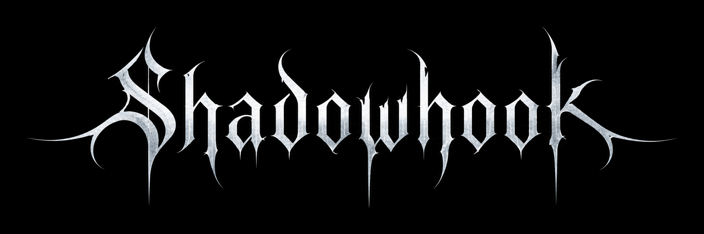
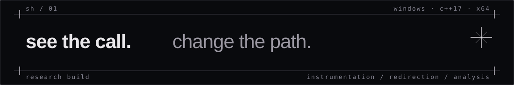
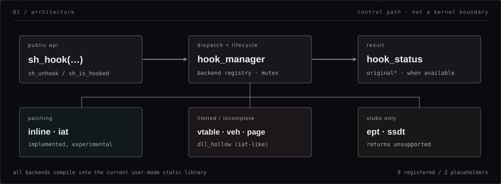
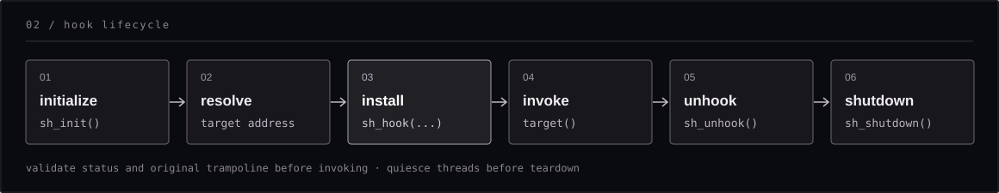
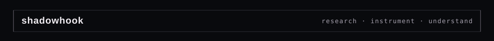

<div align="center">





<br />

<sub>experimental windows instrumentation · function redirection · backend-driven design</sub>

<br /><br />

[overview](#overview) &nbsp;·&nbsp; [architecture](#architecture) &nbsp;·&nbsp; [quick start](#quick-start) &nbsp;·&nbsp; [usage](#usage) &nbsp;·&nbsp; [backends](#backends) &nbsp;·&nbsp; [limitations](#limitations)

</div>

---

## overview

**shadowhook** is an experimental windows x64 hooking library built in c++17. it exposes a small public api backed by a registry of interchangeable hook implementations. the repository is intended for learning, instrumentation, debugging, and authorized security research.

- **one entry point** — install, query, and remove hooks through `sh_hook` / `sh_unhook`.
- **multiple strategies** — inline patches, import-address-table replacement, vtable modification, and exception-based redirection.
- **observable state** — named backend statuses and configurable logging.
- **static integration** — cmake target `shadowhook` and a bundled `api_monitor` example.

> [!IMPORTANT]
> this is **research code, not a hardened hooking engine**. having a registered backend does not imply that it is complete, production-safe, or suitable for concurrent patching. in particular, ept and ssdt are placeholders returning `unsupported`.

## architecture



<details>
<summary>explore the source layout</summary>

```text
include/shadowhook/
  shadowhook.h             public entry points
  core/                    types, manager, hook abstractions
  ring3/                   inline, vtable, veh, dll_hollow
  ring0/                   page, iat, ept, ssdt declarations
  utils/                   memory, decoder, logging, scanning
src/
  shadowhook.cpp           registration + public api bridge
  core/                    manager and hook lifecycle
  ring3/                   user-mode hook backends
  ring0/                   mixed user-mode code and stubs
  utils/                   memory, logging, instruction helpers
examples/
  api_monitor.cpp          messageboxa instrumentation demo
assets/
  logo.png                 project artwork
```

**note:** the `ring0/` directory name does **not** mean the cmake target is a kernel-mode driver. the project currently builds a user-mode static library.

</details>

## quick start

**requirements:** windows x64, cmake 3.16+, a c++17-capable msvc toolchain, windows sdk, and masm support for the x64 assembly source.

```powershell
git clone https://github.com/xvalegendary/ShadowHook.git
cd ShadowHook

cmake -S . -B build -G "Visual Studio 17 2022" -A x64
cmake --build build --config Release

.\build\Release\api_monitor.exe
```

this builds the **static library** `shadowhook` and the example executable `api_monitor`. the example hooks `MessageBoxA` in its own process, calls it, then removes the hook.

for an existing cmake application, add the repository as a subdirectory:

```cmake
add_subdirectory(external/ShadowHook)
target_link_libraries(my_app PRIVATE shadowhook)
```

`shadowhook` publishes its include directory through `target_include_directories`, so consumers can include `shadowhook/shadowhook.h`. the example is currently built unconditionally by the upstream cmake file.

## usage



### inline hook · messageboxa

this example follows the repository's `api_monitor` flow while checking the return status and keeping the original trampoline pointer separate from the exported target address.

```cpp
#include "shadowhook/shadowhook.h"
#include <windows.h>

using message_box_fn = int (WINAPI*)(HWND, LPCSTR, LPCSTR, UINT);
static message_box_fn original_message_box = nullptr;

int WINAPI intercept_message_box(HWND owner, LPCSTR, LPCSTR caption, UINT flags) {
    return original_message_box(owner, "intercepted by shadowhook", caption, flags);
}

int main() {
    sh_init();

    const HMODULE user32 = LoadLibraryA("user32.dll");
    if (!user32) {
        sh_shutdown();
        return 1;
    }

    auto* target = reinterpret_cast<void*>(GetProcAddress(user32, "MessageBoxA"));
    if (!target) {
        FreeLibrary(user32);
        sh_shutdown();
        return 1;
    }

    void* trampoline = nullptr;
    const auto status = static_cast<shadowhook::hook_status>(
        sh_hook(shadowhook::hook_type::inline_hook,
                target, reinterpret_cast<void*>(&intercept_message_box), &trampoline));

    if (status != shadowhook::hook_status::success) {
        FreeLibrary(user32);
        sh_shutdown();
        return 1;
    }

    original_message_box = reinterpret_cast<message_box_fn>(trampoline);
    reinterpret_cast<message_box_fn>(target)(nullptr, "hello", "demo", MB_OK);

    const int unhook_status = sh_unhook(target);
    original_message_box = nullptr; // safe only after in-flight calls are quiescent

    FreeLibrary(user32);
    sh_shutdown();
    return unhook_status == static_cast<int>(shadowhook::hook_status::success) ? 0 : 1;
}
```

> [!WARNING]
> an installed inline hook is **not proof that the trampoline is safe to execute**. the current implementation copies displaced instructions without generally relocating rip-relative operands or relative control flow. the example must be validated against the actual target prologue before using the `original` function pointer. patch/unpatch while other threads execute the target is also unsafe without coordination.

### api reference

| call | purpose |
| :-- | :-- |
| `sh_init()` | register available hook backends |
| `sh_hook(type, target, detour, original)` | attempt to install one hook; returns an integer `hook_status` |
| `sh_unhook(target)` | remove a hook by its original target address |
| `sh_unhook_all()` | ask every registered backend to remove its hooks |
| `sh_is_hooked(target)` | return `1` or `0` for tracked hooks |
| `sh_dump_status()` | log active counts by backend |
| `sh_set_log_level(level)` | set logger verbosity using the logger's integer enum values |
| `sh_shutdown()` | attempt cleanup through the manager |

`sh_hook` and `sh_unhook` use values from `shadowhook::hook_status`, including `success`, `already_hooked`, `not_hooked`, `invalid_address`, `alloc_failed`, `protect_failed`, `unsupported`, and `partial`. only treat `success` as a successful installation.

## backends

| backend | current state | behavior / scope |
| :-- | :-- | :-- |
| `inline_hook` | experimental | patches a function entry and creates a trampoline; relocation and thread-safety caveats apply |
| `iat_shadow` | experimental | rewrites the matching iat slot of the main executable, not every loaded module |
| `vtable` | limited | currently replaces the first vtable entry; this changes the shared table, not an instance-private clone |
| `exception_veh` | experimental | plants an `int3` and redirects via vectored exception handling; rearming is incomplete |
| `page_shadow` | incomplete | allocates a copied page and plants `int3`, but does not implement a complete shadow-page execution route |
| `dll_hollow` | experimental / naming caveat | currently performs an iat-slot replacement, not general-purpose dll hollowing |
| `ept` | placeholder | returns `unsupported`; no hypervisor integration |
| `ssdt_shadow` | placeholder | returns `unsupported`; no kernel driver integration |

there are **eight backend registrations** in `src/shadowhook.cpp`. its current startup log hardcodes “7 backends registered”; that text is not an accurate count.

## limitations

- **architecture:** code paths assume windows x64 (`rip`, `image_nt_headers64`, and x64 jump stubs). other architectures are not established as supported.
- **instruction rewriting:** the inline trampoline does not provide a general-purpose relocator for rip-relative instructions or relative branches.
- **execution safety:** patches, executable memory permissions, and hook removal need a robust concurrency and in-flight-call strategy before production use.
- **backend semantics:** registered backends vary substantially in completeness. directory names are not privilege boundaries.
- **cleanup reporting:** `sh_unhook_all()` / shutdown visit placeholder backends; their `unsupported` results can produce an aggregate `partial` status even when no ept/ssdt hook was installed.
- **language boundary:** despite `extern "C"` linkage, the public header exposes a c++ enum parameter and is therefore a **c++ api** as currently declared.
- **validation:** this readme documents the current implementation; it does not imply a successful windows build or runtime test on every target build.

## development notes

begin with [`examples/api_monitor.cpp`](examples/api_monitor.cpp), then follow `sh_hook` into [`src/shadowhook.cpp`](src/shadowhook.cpp) and [`src/core/hook_manager.cpp`](src/core/hook_manager.cpp). each implementation lives under `src/ring3/` or `src/ring0/` and derives from the common backend abstraction.

for trustworthy hook engines, prioritize disassembly and relocation correctness, atomic patch strategies, page-protection restoration, instruction-cache coherency, module lifetime, and structured teardown. **correctness before stealth.**

## license

released under the [mit license](LICENSE).

<div align="center">
  
</div>
